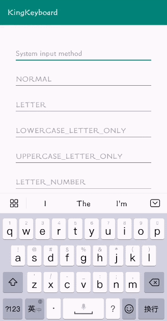

# KingKeyboard


[](https://raw.githubusercontent.com/jenly1314/KingKeyboard/master/app/release/app-release.apk)
[](https://bintray.com/beta/#/jenly/maven/kingkeyboard)
[](https://repo1.maven.org/maven2/com/github/jenly1314/kingkeyboard)
[](https://jitpack.io/#jenly1314/KingKeyboard)
[](https://travis-ci.org/jenly1314/KingKeyboard)
[](https://circleci.com/gh/jenly1314/KingKeyboard)
[](https://android-arsenal.com/api?level=21)
[](https://opensource.org/licenses/mit-license.php)
[](https://jenly1314.github.io/)
[](http://shang.qq.com/wpa/qunwpa?idkey=8fcc6a2f88552ea44b1411582c94fd124f7bb3ec227e2a400dbbfaad3dc2f5ad)

KingKeyboard for Android 是一个自定义键盘。内置了满足各种场景的键盘需求：包括但不限于混合、字母、数字、电话、身份证、车牌号等可输入场景。还支持自定义。集成简单，键盘可定制化。


## Gif 展示


> 你也可以直接下载 [演示App](https://raw.githubusercontent.com/jenly1314/KingKeyboard/master/app/release/app-release.apk) 体验效果


## 引入

### Gradle:

1. 在Project的 **build.gradle** 里面添加远程仓库  
          
```gradle
allprojects {
    repositories {
        //...
        mavenCentral()
    }
}
```

2. 在Module的 **build.gradle** 里面添加引入依赖项
```gradle
implementation 'com.github.jenly1314:kingkeyboard:1.0.4'

```

以前发布至JCenter的版本

```gradle
//AndroidX
implementation 'com.king.keyboard:kingkeyboard:1.0.0'
```


## 自定义按键值
```Kotlin

 /*
  * 在KingKeyboard的伴生对象中定义了一些核心的按键值，当您需要自定义键盘时，可能需要用到
  */

 //------------------------------ 下面是定义的一些公用功能按键值
        /**
         * Shift键 -> 一般用来切换键盘大小写字母
         */
        const val KEYCODE_SHIFT = -1
        /**
         * 模式改变 -> 切换键盘输入法
         */
        const val KEYCODE_MODE_CHANGE = -2
        /**
         * 取消键 -> 关闭输入法
         */
        const val KEYCODE_CANCEL = -3
        /**
         * 完成键 -> 长出现在右下角蓝色的完成按钮
         */
        const val KEYCODE_DONE = -4
        /**
         * 删除键 -> 删除输入框内容
         */
        const val KEYCODE_DELETE = -5
        /**
         * Alt键 -> 预留，暂时未使用
         */
        const val KEYCODE_ALT = -6
        /**
         * 空格键
         */
        const val KEYCODE_SPACE = 32

        /**
         * 无作用键 -> 一般用来占位或者禁用按键
         */
        const val KEYCODE_NONE = 0

        //------------------------------

        /**
         * 键盘按键 -> 返回（返回，适用于切换键盘后界面使用，如：NORMAL_MODE_CHANGE或CUSTOM_MODE_CHANGE键盘）
         */
        const val KEYCODE_MODE_BACK = -101

        /**
         * 键盘按键 ->返回（直接返回到最初,直接返回到NORMAL或CUSTOM键盘）
         */
        const val KEYCODE_BACK = -102

        /**
         * 键盘按键 ->更多
         */
        const val KEYCODE_MORE = -103

        //------------------------------ 下面是自定义的一些预留按键值，与共用按键功能一致,但会使用默认的背景按键

        const val KEYCODE_KING_SHIFT = -201
        const val KEYCODE_KING_MODE_CHANGE = -202
        const val KEYCODE_KING_CANCEL = -203
        const val KEYCODE_KING_DONE = -204
        const val KEYCODE_KING_DELETE = -205
        const val KEYCODE_KING_ALT = -206

        //------------------------------ 下面是自定义的一些功能按键值，与共用按键功能一致,但会使用默认背景颜色

        /**
         * 键盘按键 -> 返回（返回，适用于切换键盘后界面使用，如：NORMAL_MODE_CHANGE或CUSTOM_MODE_CHANGE键盘）
         */
        const val KEYCODE_KING_MODE_BACK = -251

        /**
         * 键盘按键 ->返回（直接返回到最初,直接返回到NORMAL或CUSTOM键盘）
         */
        const val KEYCODE_KING_BACK = -252

        /**
         * 键盘按键 ->更多
         */
        const val KEYCODE_KING_MORE = -253

        /*
            用户也可自定义按键值，primaryCode范围区间为-999 ~ -300时，表示预留可扩展按键值。
            其中-399~-300区间为功能型按键，使用Special背景色，-999~-400自定义按键为默认背景色
        */

```

## 示例


### 代码示例

```Kotlin
    //初始化KingKeyboard
    kingKeyboard = KingKeyboard(this,keyboardParent)
    //然后将EditText注册到KingKeyboard即可
    kingKeyboard.register(editText,KingKeyboard.KeyboardType.NUMBER)

    /*
     * 如果目前所支持的键盘满足不了您的需求，您也可以自定义键盘，KingKeyboard对外提供自定义键盘类型。
     * 自定义步骤也非常简单，只需自定义键盘的xml布局，然后将EditText注册到对应的自定义键盘类型即可
     *
     * 1. 自定义键盘Custom，自定义方法setKeyboardCustom，键盘类型为{@link KeyboardType#CUSTOM}
     * 2. 自定义键盘CustomModeChange，自定义方法setKeyboardCustomModeChange，键盘类型为{@link KeyboardType#CUSTOM_MODE_CHANGE}
     * 3. 自定义键盘CustomMore，自定义方法setKeyboardCustomMore，键盘类型为{@link KeyboardType#CUSTOM_MORE}
     *
     * xmlLayoutResId 键盘布局的资源文件，其中包含键盘布局和键值码等相关信息
     */
    kingKeyboard.setKeyboardCustom(R.xml.keyboard_custom)
//        kingKeyboard.setKeyboardCustomModeChange(xmlLayoutResId)
//        kingKeyboard.setKeyboardCustomMore(xmlLayoutResId)
    kingKeyboard.register(et12,KingKeyboard.KeyboardType.CUSTOM)

```

```Kotlin
 //获取键盘相关的配置信息
 var config = kingKeyboard.getKeyboardViewConfig()

 //... 修改一些键盘的配置信息

 //重新设置键盘配置信息
 kingKeyboard.setKeyboardViewConfig(config)

 //按键是否启用震动
 kingKeyboard.setVibrationEffectEnabled(isVibrationEffectEnabled)

 //... 还有各种监听方法。更多详情，请直接使用。

```

```Kotlin
    //在Activity或Fragment相应的生命周期中调用，如下所示

    override fun onResume() {
        super.onResume()
        kingKeyboard.onResume()
    }

    override fun onDestroy() {
        super.onDestroy()
        kingKeyboard.onDestroy()
    }

```


**v1.0.2** 新增：**KingKeyboard.sendKey(params)** 的用法示例：

```kotlin
        val beforeCount = 0

        kingKeyboard.register(et,KingKeyboard.KeyboardType.LICENSE_PLATE_PROVINCE)

        //通过监听输入框内容改变，来通过发送功能键来切换键盘（这里只是举例展示kingKeyboard.sendKey的用法，具体怎么用还需根据需求场景去决定）
        et.addTextChangedListener(object : TextWatcher{
            override fun beforeTextChanged(s: CharSequence?, start: Int, count: Int, after: Int) {
                beforeCount = s?.length ?: 0
            }

            override fun onTextChanged(s: CharSequence?, start: Int, before: Int, count: Int) {
                when(s?.length){
                    0 -> {//车牌键盘：如果输入的内容长度改变为0，并且当前的键盘不是省份键盘模式时，通过发送“返回”功能按键值，让键盘自动切换到省份键盘模式
                        if(kingKeyboard.getKeyboardType() != KingKeyboard.KeyboardType.LICENSE_PLATE_PROVINCE){
                            kingKeyboard.sendKey(KingKeyboard.KEYCODE_BACK)
                        }
                    }
                    1 -> {//车牌键盘：如果输入的内容长度从0改变为1，并且当前的键盘为省份键盘模式时，通过发送“模式改变”功能按键值，让键盘自动切换到字母键盘模式
                        if(beforeCount == 0 && kingKeyboard.getKeyboardType() == KingKeyboard.KeyboardType.LICENSE_PLATE_PROVINCE){
                            kingKeyboard.sendKey(KingKeyboard.KEYCODE_MODE_CHANGE)
                        }
                    }
                }
            }

            override fun afterTextChanged(s: Editable?) {

            }

        })
```

### 相关说明

> * **KingKeyboard** 主要采用Kotlin编写实现，如果您的项目使用的是Java编写，集成时语法上可能稍微有点不同，除了结尾没有分号以外，对应类伴生对象中的常量，需要通过点伴生对象才能获取。

```Kotlin
  //Kotlin 写法
  var keyCode = KingKeyboard.KEYCODE_SHIFT
```

```Java
  //Java 写法
  int keyCode = KingKeyboard.Companion.KEYCODE_SHIFT;
```


更多使用详情，请查看[app](app)中的源码使用示例或直接查看[API帮助文档](https://jenly1314.github.io/projects/KingKeyboard/doc/)

### 相关推荐

#### [SplitEditText](https://github.com/jenly1314/SplitEditText) 一个灵活的分割可编辑框；常常应用于 **验证码输入** 、**密码输入** 等场景。    

## 版本记录

#### v1.0.4：2021-11-18
*  修复动态修改默认键盘字体大小不生效问题

#### v1.0.3：2021-10-22
*  优化细节

#### v1.0.2：2021-9-29 
*  新增 **KingKeyboard.sendKey(primaryCode: Int)** 方法；（支持通过发送按键的值来控制键盘）

#### v1.0.1：2021-9-3 (从v1.0.1开始发布至 MavenCentral)
*  优化按键提示音策略（跟随系统的提示音设置）

#### v1.0.0：2020-1-16
*  KingKeyboard初始版本

## 赞赏
如果您喜欢KingKeyboard，或感觉KingKeyboard帮助到了您，可以点右上角“Star”支持一下，您的支持就是我的动力，谢谢 :smiley:<p>
您也可以扫描下面的二维码，请作者喝杯咖啡 :coffee:
    <div>
        
        
        
        
    </div>

## 关于我
   Name: <a title="关于作者" href="https://about.me/jenly1314" target="_blank">Jenly</a>

   Email: <a title="欢迎邮件与我交流" href="mailto:jenly1314@gmail.com" target="_blank">jenly1314#gmail.com</a> / <a title="给我发邮件" href="mailto:jenly1314@vip.qq.com" target="_blank">jenly1314#vip.qq.com</a>

   CSDN: <a title="CSDN博客" href="http://blog.csdn.net/jenly121" target="_blank">jenly121</a>

   CNBlog: <a title="博客园" href="https://www.cnblogs.com/jenly" target="_blank">jenly</a>

   Github: <a title="Github开源项目" href="https://github.com/jenly1314" target="_blank">jenly1314</a>

   加入QQ群: <a title="点击加入QQ群" href="http://shang.qq.com/wpa/qunwpa?idkey=8fcc6a2f88552ea44b1411582c94fd124f7bb3ec227e2a400dbbfaad3dc2f5ad" target="_blank">20867961</a>
   <div>
       
       
   </div>
